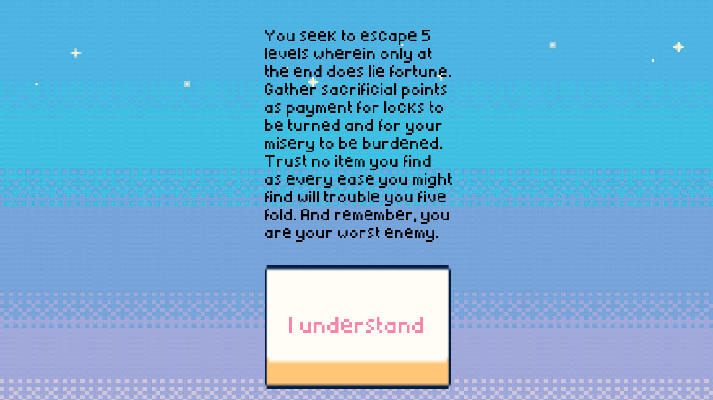
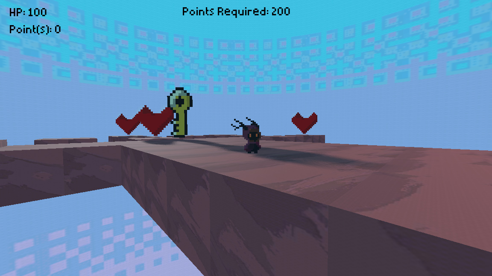
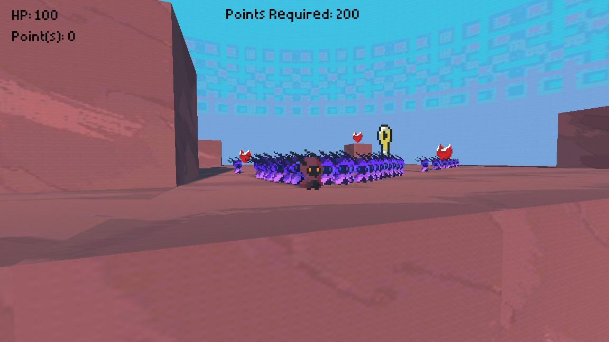

# BUETGameJam2023-TeamWyvern-Godot-3DPlatformer-FLIPNFROLIC
## name: FLIP 'N' FROLIC
### link: https://tanzeem-ahmed-sakib.itch.io/flip-n-frolic

The theme for the BUET CSE Fest Game Jam 2023 was "you are your own enemy." With this theme in mind, Flip 'n' Frolic was developed and submitted. Flip 'n' Frolic is a Puzzle based 3D Platformer where you play as a lovable 2D pixel sprite in a 3D environment with gorgeous color palettes. There are 5 levels you have to beat to progress and eventually beat the game. Collecting the required amount of points will let you progress to the next level but beware, collecting points also severely damage you, more than the mobs that inhabit this world itself or even falling down from platforms, collecting points also slow you down! In later levels, you can collect booster keys, which will make you faster and jump higher but even these come at a cost, half your health! Use these to complete puzzles and make choices because if you die once you will be taken right at the start. Think ahead for you truly are your worst enemy.

### Gameplay Overview Trailer:

### Assets used:

https://caniaeast.itch.io/simple-sky-pixel-backgrounds

https://lucky-loops.itch.io/character-satyr

https://flakdeau19.itch.io/high-resolution-pixel-art-textures

https://mounirtohami.itch.io/pixel-art-gui-elements

https://rp-bricks.itch.io/heart-rotate-spritesheet

https://rp-bricks.itch.io/key-sprite-sheet

-Led the design, development, and implementation of core gameplay mechanics, player
controls, and resource management systems.

-Created pixel art assets, animations, and sound effects to enhance the game's aesthetic
and user experience.

-Adapted game mechanics and level designs to fit the jam’s themes, ensuring a cohesive
and engaging player experience.

-Managed the full lifecycle of game development, from concept to prototype, within time
constraints.

-Successfully developed and released multiple playable games, with each submission
highlighting unique gameplay elements and creative interpretations of the jam themes.

-Demonstrated strong time management skills, delivering polished games on tight
deadlines.

-Gained hands-on experience in solo development, adapting to feedback and iterating on
mechanics quickly.
